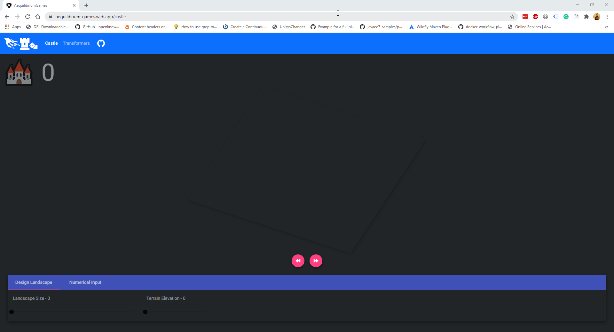

# AEquilibrium Games

Checkout the working app here: 
-  Part 1 Castle Company => https://aequilibrium-games.web.app/castle
-  Part 2 Transformers Battle => https://aequilibrium-games.web.app/transformers

## Part 1: The Castle Company

Aequilibrium is in the business of building castles (we really aren’t, but let’s pretend). Now, we also believe in
quality aesthetics, so we only want to build castles in two types of places:

1. Peaks 
2. Valleys 

Let’s say you have an array of integers that describes a stretch of land, where each integer represents
the current height of the land. Can you write a function that reads that array and returns the number of castles that
Aequilibrium should build on that stretch of land? You can write this solution in whatever language you like and provide
a way to test it. You can make the following assumptions:

You can always build a castle at the start of the array, provided it is non-empty 

- You can always build a castle at the end of the array, provided it is non-empty
- We only want to build one castle per peak or valley. 
- A peak is an integer or series of integers that is above the immediately preceding and following ints. For example, in the
sequence `[2,6,6,6,3]` the sequence of three 6s is a peak.  
- A valley is an integer or series of integers that is below the immediately preceding and following ints. 
  For example, in the sequence `[6,1,4]` the "1" would be a valley. 
 
### Testing Castle Company Using Design Mode:

Checkout the working app here -> https://aequilibrium-games.web.app/castle

Draw the peek and valleys please be aware the 1D array is displayed as (nxn) grid. The "number of castles" that can be built 
is displayed on the left-hand side corner of the screen.


Alternately you can pass in the array using the numeric input. As shown below.



If you like to verify them using unit test cases run the following command on the projects root directory:
```bash
ng test
```

### Part 2: The Transformation Company

Checkout the working app here  -> https://aequilibrium-games.web.app/transformers


To modify the input autobot and decepticons array run the project locally and update the
json file located at `src/assets/data/transformers.json`

```json
[
    ["Soundwave", "D", 8,9,2,6,7,5,6,10],
    ["Bluestreak", "A", 6,6,7,9,5,2,9,7],
    ["Hubcap", "A", 4,4,4,4,4,4,4,4]
]
```


If you like to verify them using unit test cases run the following command on the projects root directory:
```bash
ng test
```
---
This project was generated with [Angular CLI](https://github.com/angular/angular-cli) version 11.0.1.

## Development server

Run `ng serve` for a dev server. Navigate to `http://localhost:4200/`. The app will automatically reload if you change
any of the source files.

## Code scaffolding

Run `ng generate component component-name` to generate a new component. You can also
use `ng generate directive|pipe|service|class|guard|interface|enum|module`.

## Build

Run `ng build` to build the project. The build artifacts will be stored in the `dist/` directory. Use the `--prod` flag
for a production build.

## Running unit tests

Run `ng test` to execute the unit tests via [Karma](https://karma-runner.github.io).

## Running end-to-end tests

Run `ng e2e` to execute the end-to-end tests via [Protractor](http://www.protractortest.org/).

## Further help

To get more help on the Angular CLI use `ng help` or go check out
the [Angular CLI Overview and Command Reference](https://angular.io/cli) page.
